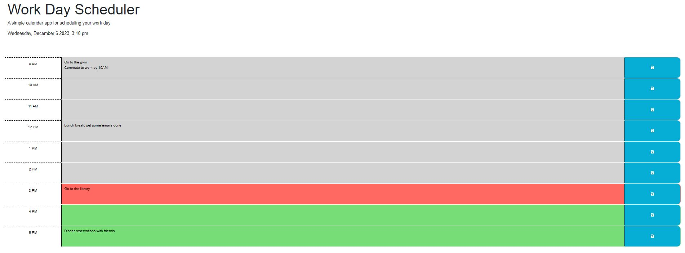

# Work Day Scheduler

## Description

A simple calendar application that allows a user to save events for each hour of a typical working day (9am–5pm).

## Table of Contents

-  [User Story](#user-story)
-  [Acceptance Criteria](#acceptance-criteria)
-  [Functionality](#functionality)
-  [Access](#access)
-  [Credits](#credits)
-  [License](#license)

## User Story

-  AS AN employee with a busy schedule
-  I WANT to add important events to a daily planner
-  SO THAT I can manage my time effectively

## Acceptance Criteria

-  GIVEN I am using a daily planner to create a schedule

-  WHEN I open the planner
-  THEN the current day is displayed at the top of the calendar

-  WHEN I scroll down
-  THEN I am presented with time blocks for standard business hours of 9am to 5pm

-  WHEN I view the time blocks for that day
-  THEN each time block is color-coded to indicate whether it is in the past, present, or future

-  WHEN I click into a time block
-  THEN I can enter an event

-  WHEN I click the save button for that time block
-  THEN the text for that event is saved in local storage

-  WHEN I refresh the page
-  THEN the saved events persist

## Functionality

The following screenshot demonstrates the application functionality: 

## Access

-  The URL of the functional, deployed application:
-  [Workday Planner Live Page](https://ruthiepina.github.io/Workday-Planner/)

-  The URL of the GitHub repository:
-  [Workday Planner Repo](https://github.com/ruthiepina/Workday-Planner)

## Credits

Following sources are where I searched for class examples, syntax information, different JavaScript elements, troubleshooting code, etc.

-  https://www.w3schools.com
-  https://coding-boot-camp.github.io/full-stack/github/professional-readme-guide\
-  https://developer.mozilla.org/en-US/
-  https://git.bootcampcontent.com/University-of-Utah/UofU-VIRT-FSF-PT-10-2023-U-LOLC/-/tree/main/05-Third-Party-APIs
-  Day.js library

## License

MIT License
